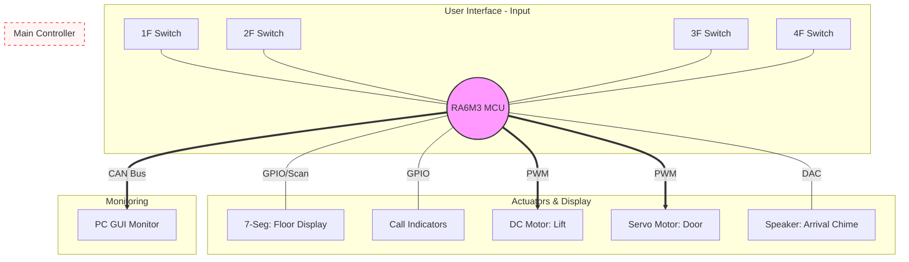

# RA6M3-Elevator-System
RA6M3 기반 엘리베이터 시스템: 4층 스위치 입력 및 DC/서보 모터 제어와 CAN 통신 모니터링 구현
- RA6M3 MCU를 활용하여 입력 처리부터 복합 모터 제어, CAN 통신 모니터링까지 구현한 종합 엘리베이터 제어 시스템입니다.

---

## 1. Key Features
- Full Interaction: 4개 층 스위치 입력을 통한 개별 호출 및 우선순위 이동 로직 구현.
- Dual Motor Precision Control:
  - DC Motor: PWM 제어를 통해 엘리베이터의 부드러운 승강 및 층간 정지 구현.
  - Servo Motor: 도착 시 엘리베이터 문(Door)의 개폐 동작 제어.
- Visual & Audio Feedback:
  - 7-Segment로 현재 위치 표시 및 LED로 호출 대기 상태 가시화.
  - DAC 스피커를 사용하여 층 도착 시 안내 멜로디 출력.
- Real-time CAN Monitoring: CAN 통신 프로토콜을 설계하여 PC에서 현재 층, 모터 상태, 입력 로그를 실시간 확인 가능.

## 2. System Architecture


---

## 3. Project Structure
```text
├── code/                   # RA6M3 e2 studio Project (C Source)
│   ├── .settings/          # Project environment settings
│   ├── ra/                 # FSP Library
│   ├── ra_cfg/             # FSP Configuration Headers
│   ├── ra_gen/             # FSP Generated Code
│   ├── script/             # Linker Scripts
│   ├── src/                # Elevator Logic & CAN Drivers
│   ├── configuration.xml   # FSP Config File
│   └── *.pincfg            # Pin Configuration
├── pc-monitoring/          # PC GUI Source Code (CAN Monitor)
├── docs/                   # Design Documents & Diagrams
└── README.md               # Main Description
```

## 4. Pin Mapping
| Category | Component | Pin | Function |
| :--- | :--- | :--- | :--- |
| Input | Switches | P100 ~ P103 | GPIO Input (Internal Pull-up) |
| Motor | DC Motor | P401, P402 | GPT PWM (Speed/Dir) |
| Motor | Servo Motor | P403 | GPT PWM (Door Control) |
| Display | 7-Seg | P200 ~ P210 | GPIO (Dynamic Scanning) |
| Comm. | CAN | P109, P110 | CAN0 TX/RX (500kbps) |
| Audio | Speaker | P014 | DAC0 (Arrival Chime) |

## 6. Development Environment
- MCU: Renesas RA6M3 (R7FA6M3AH3CFC)
- IDE: e2 studio
- FSP Version: 5.x.x
- Language: C / Embedded C
