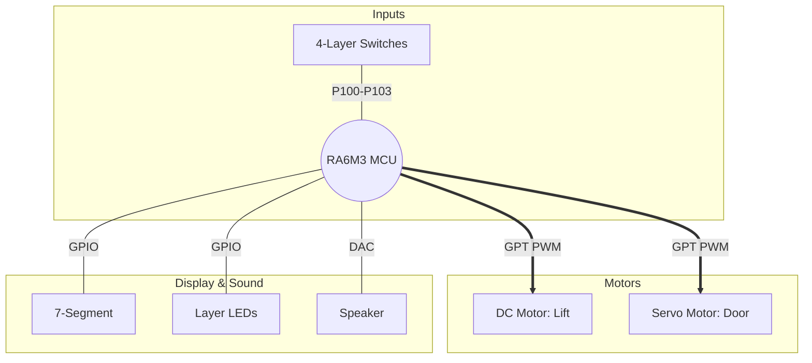

# Hardware Configuration & Pin Mapping

본 문서는 RA6M3 엘리베이터 시스템의 하드웨어 인터페이스와 핀 할당을 정의합니다.

## 1. System Architecture

## 2. Pin Mapping Table
| Category | Component | Pin | Function | Note |
| :--- | :--- | :--- | :--- | :--- |
| Input | Switches (1F~4F) | P100 ~ P103 | GPIO Input | Internal Pull-up |
| Output | Call LEDs (1F~4F) | P104 ~ P107 | GPIO Output | Active High |
| Output | 7-Segment (FND) | P200 ~ P210 | GPIO Output | Dynamic Scanning |
| Motor | Lift DC Motor | P401, P402 | GPT PWM | Speed & Direction |
| Motor | Door Servo Motor | P403 | GPT PWM | 50Hz (Angle Control) |
| Audio | DAC Speaker | P014 | DAC0 | Arrival Chime Output |
| Comm. | CAN Transceiver | P109, P110 | CAN0 TX/RX | 500kbps Baudrate |

---

## 3. Peripheral Details

### 3.1 User Inputs & Indicators
- Switch: 4개의 물리적 스위치를 통해 사용자의 층별 호출을 입력받습니다. 내부 풀업 저항을 사용하여 회로를 간소화했습니다.
- LED & 7-Segment: 스위치 입력 시 즉각적인 LED 피드백(호출 확인)을 제공하며, 7-Segment는 다이내믹 스캐닝 기법을 통해 현재 엘리베이터의 층수를 실시간으로 표시합니다.

### 3.2 Motion Control (Motors)
- DC Motor: GPT(General Purpose Timer)의 PWM 출력을 활용하여 승강기의 속도를 제어합니다. H-Bridge 드라이버와 연결되어 목표 층에 따른 정/역회전(상승/하강)을 수행합니다.
- Servo Motor: 20ms(50Hz) 주기의 PWM 신호를 사용하여 엘리베이터 문의 개폐를 담당합니다. 도착 시 90도로 회전하여 문을 열고, 일정 시간 후 다시 0도로 닫히도록 설정되어 있습니다.

### 3.3 Audio & Communication
- DAC Speaker: 12-bit DAC를 사용하여 층 도착 시 부드러운 아날로그 파형의 안내 멜로디를 출력합니다.
